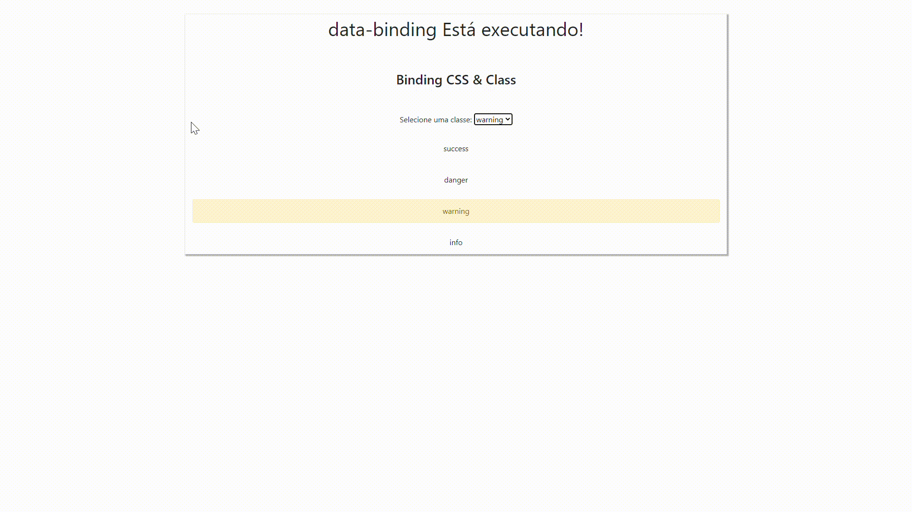
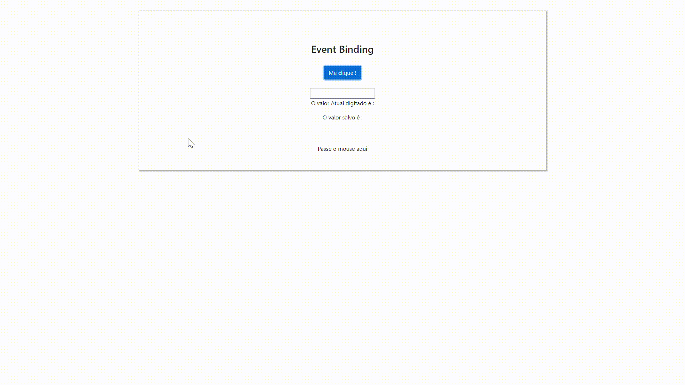
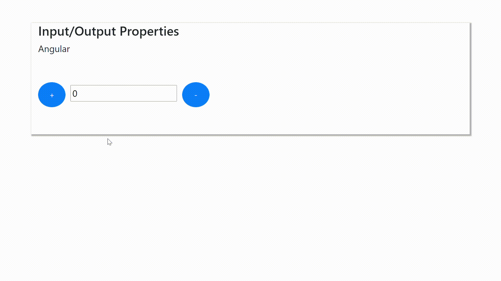

# Aprendendo Angular CLI

### Por CODAR2

## Primeiro-projeto - *Hello World*

## Usando Class & CSS Binding

## Usando o Event Binding

## Input/Output Properties

## Obrigado por chegar até aqui
